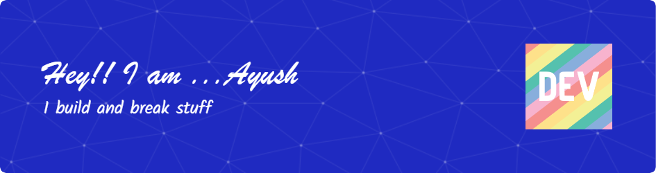

<h1>
  
</h1>
 
<!-- - :mailbox:Reach me :  -->

  

    
   

  

  

 

<ul>
  <li>  I'm currently pursuing B.Tech. in Computer Science Engineering at SRMIST,Chennai,India 🇮🇳</li>
  <li>I'm a Frontend Web Developer and specialise in ReactJS,TailwindCSS and NextJS👻.</li>
<li> I’m currently learning Backened using NodeJs,MongoDB,Django,ExpressJS👀.</li>
<li> Looking to intern React Developers Role!!.</li>
<li>I'm exploring Google Cloud and also have keen interest in AiMl in topics related to Natural Language Processing and Computer Vision.🥹</li>
  <li>Also improving my problem solving and DSA skills</li>
<li> I love Coding,Cricket,PC Games,Travelling and exploring the world🕶.</li>
  <li>You'll also find me watching a lot of SciFi movies and documentaries,i love them all<3💭</li>
    

  </ul>
  

 
  

   
  

   
    
  

   

    

 
<!--    stats -->
<!--  

 
 
   
  
  
 <!--
  
-->
<!-- 
 --> 
 

         
        
  
  

  
    

  
  

  

  
  

<!--     

    
  

  

&nbsp;&nbsp;

  

